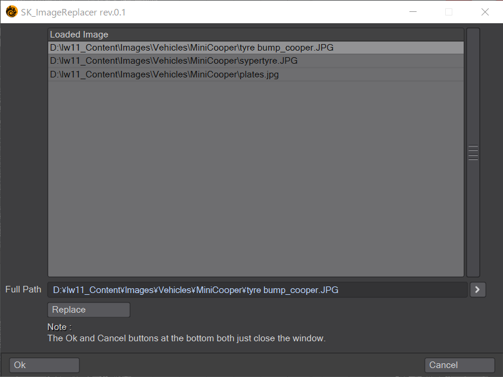

# SK_ImageReplacer

Lightwave 3D Modeler用のLScriptです。

## Overview
Modelerにロードされているイメージをファイルのフルパスを確認しながら置き換えます。

## How To Use

スクリプトを実行するとウィンドウが表示されます。

Loaded Imageから変更したいイメージ(ファイル)を選択します。

Full Pathに現在のパスが表示されます。

右側の「>」を押して置き換え先のファイルを指定します。

「Replace」ボタンを押すとファイルが置き換わります。

作業が完了したら「Ok」または「Cancel」を押してウィンドウを閉じます。

## Change log
2022.08.20 (rev.0.1)
新規作成