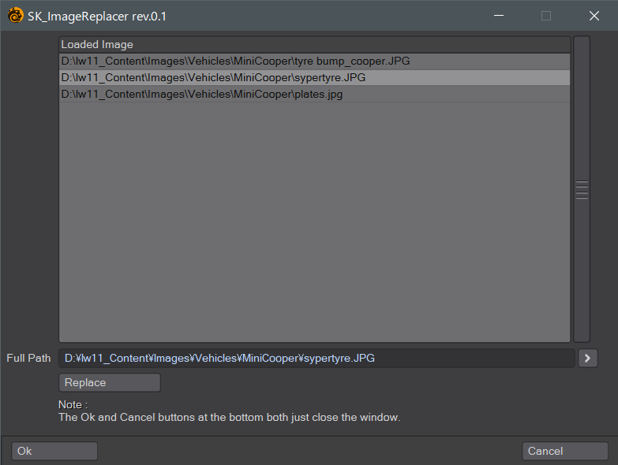

# SK_ImageReplacer

Lightwave 3D Modeler用のLScriptです。

## Overview
Modelerにロードされているイメージをファイルのフルパスを確認しながら置き換えることができます。

## How To Use

SK_ImageReplacer.lsをプラグインとしてインストール、または実行します。

スクリプトを実行するとウィンドウが表示されます。

Loaded Imageから変更したいイメージ(ファイル)を選択します(複数選択不可)。

Full Pathに現在のパスが表示されます。

右側の「>」を押して置き換え先のファイルを指定します。

「Replace」ボタンを押すと指定したファイルに置き換わります。

作業が完了したら「Ok」または「Cancel」を押してウィンドウを閉じます。

## Change log
2022.08.20 (rev.0.1)
新規作成
